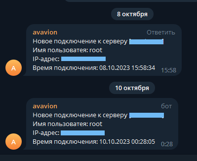

# Telegram SSH notifier

Set GROUP_ID and TOKEN in telegram-sender.sh



```
To work you need to create a file ssh-login.sh in the directory /etc/profile.d

telegram-sender.sh can be located in any convenient directory. In this case, you should correct the path to the executable file
```